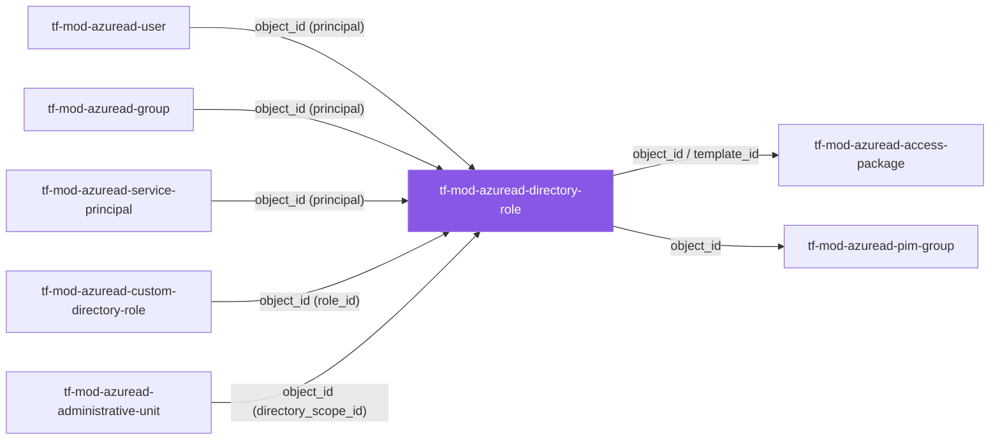
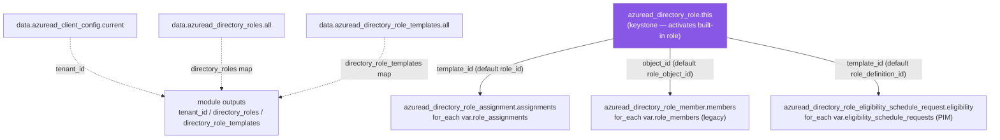

# 🚀 Azure AD **Directory Role** Terraform Module

> **Activates a built-in Microsoft Entra ID directory role and wires up its standing assignments, legacy members, and PIM just-in-time eligibility behind one typed, secure-by-default module boundary.** Deeply-typed `object` schemas, every collection driven by a stable-keyed `for_each`, `try`/`coalesce`-total renderer, zero credentials. Built for azuread **v3.x**.

    

---

## 🧩 Overview

This module manages the full lifecycle of a **built-in Entra ID directory (administrator) role** activation and the access granted against it:

- 🟣 **Activates** a built-in directory role from its template (`template_id`) or display name — built-in roles are immutable and pre-defined; this module *activates* an existing role so assignments can be made.
- 👥 **Standing assignments** (`azuread_directory_role_assignment`) — grant a principal the role **immediately and indefinitely**.
- 🪪 **Legacy members** (`azuread_directory_role_member`) — backward-compatible membership for state predating the assignment resource.
- ⏳ **PIM eligibility** (`azuread_directory_role_eligibility_schedule_request`) — make a principal **eligible** for just-in-time activation rather than permanently active (requires Entra ID P2).
- 🔎 **Tenant discovery** — surfaces maps of every activated role and role template so callers can resolve object/template IDs without hard-coding GUIDs.

> 💡 **Why it matters:** privileged access is the highest-blast-radius surface in the tenant. Codifying *who* holds *which* directory role — and whether that access is standing or just-in-time — makes role grants reviewable, auditable, and reproducible instead of click-ops in the portal.

---

## ❤️ Support this project

If these Terraform modules have been helpful to you or your organization, I'd appreciate your support in any of the following ways:

- ⭐ **Star this repository** to help others discover this Terraform module.
- 🤝 **Connect with me on LinkedIn:** [linkedin.com/in/microsoftexpert](https://www.linkedin.com/in/microsoftexpert)
- ☕ **Buy me a coffee:** [buymeacoffee.com/microsoftexpert](https://buymeacoffee.com/microsoftexpert)

Whether it's a star, a professional connection, or a coffee, every gesture helps keep these modules actively maintained and continually improving. Thank you for being part of the community!

---

## 🗺️ Where this fits in the family



Identity modules (`user`, `group`, `service_principal`) supply **principal object IDs**; `custom_directory_role` can supply a custom **role_id**; `administrative_unit` can supply a scoped **directory_scope_id**. This module emits the activated role's `object_id` / `template_id` for downstream governance.

---

## 🧬 What this module builds



**Resource inventory**

| Role | Resource | Cardinality |
|---|---|---|
| 🟣 Keystone | `azuread_directory_role.this` | 1 |
| Standing assignment | `azuread_directory_role_assignment.assignments` | `for_each` over `var.role_assignments` |
| Legacy member | `azuread_directory_role_member.members` | `for_each` over `var.role_members` |
| PIM eligibility | `azuread_directory_role_eligibility_schedule_request.eligibility` | `for_each` over `var.eligibility_schedule_requests` |
| Data (read-only) | `azuread_client_config`, `azuread_directory_roles`, `azuread_directory_role_templates` | 1 each |

---

## ✅ Provider / Versions

```hcl
terraform {
  required_version = ">= 1.12.0"
  required_providers {
    azuread = {
      source  = "hashicorp/azuread"
      version = ">= 2.0, < 4.0"
    }
  }
}
```

- **Terraform** `>= 1.12.0` (cross-variable `validation` is used — requires ≥ 1.9).
- **azuread** `>= 2.0, < 4.0` — validated against **v3.9.0**.
- The module declares the provider **requirement** only — it configures **no** `provider "azuread" {}` block, so it composes cleanly under any root configuration.

> ⚠️ **Provider gotchas baked into this module:**
> - `azuread_directory_role` performs **no action on destroy** — once a built-in role is activated it cannot be deactivated. Removing it from config simply drops it from state.
> - The directory role supports **create / read / delete** timeouts only — there is no `update` (built-in roles are immutable).
> - `azuread_directory_role_member` is **deprecated** (superseded by `azuread_directory_role_assignment`) and emits a deprecation warning, but still functions under the `< 4.0` pin. Use it only for compatibility.
> - All identity/scope fields on the three child resources are **ForceNew**.

---

## 🔑 Graph API Permissions Required

The Terraform **service principal** needs the following Microsoft Graph **application** permissions before `apply` will succeed:

| Permission | Type | Required for |
|---|---|---|
| `RoleManagement.Read.Directory` | Application | Reading activated roles & role templates — the two discovery data sources (least-privileged read). |
| `RoleManagement.ReadWrite.Directory` | Application | Activating the role and creating assignments, legacy members, and PIM eligibility requests. Graph identifier `9e3f62cf-ca93-4989-b6ce-bf83c28f9fe8`. |
| `RoleEligibilitySchedule.ReadWrite.Directory` | Application | *(Alternative for PIM eligibility only.)* Not required when `RoleManagement.ReadWrite.Directory` is granted — it is a superset. |

> ⚠️ **Admin consent required.** `RoleManagement.ReadWrite.Directory` requires tenant admin consent and is **self-elevating** — per Microsoft, *"an application can grant additional privileges to itself, other applications, or any user."* Treat the Terraform SP as a tier-0 identity: restrict who can run `apply`, and prefer PIM eligibility over standing assignments for the SP itself.
>
> ℹ️ When authenticating as a **user** principal (not an SP), the signed-in user must hold the **Privileged Role Administrator** or **Global Administrator** directory role.
>
> ⚠️ **PIM eligibility requires Microsoft Entra ID P2** (or Entra ID Governance) licensing in the tenant. Without it the eligibility schedule request fails.

---

## 📁 Module Structure

```
tf-mod-azuread-directory-role/
├── providers.tf # azuread >= 2.0, < 4.0; Terraform >= 1.12.0 (no provider block)
├── variables.tf # display_name → template_id → 3 collection maps → timeouts
├── main.tf # keystone this + 3 for_each children + 3 data sources
├── outputs.tf # object_id (primary) + keyed maps + tenant discovery
├── SCOPE.md # cross-module contract + Graph permissions + design decisions
└── README.md
```

---

## ⚙️ Quick Start

```hcl
module "security_admin_role" {
  source = "git::https://github.com/microsoftexpert/tf-mod-azuread-directory-role?ref=v1.0.0"

  # Activate by stable template ID (preferred over display_name)
  template_id = "194ae4cb-b126-40b2-bd5b-6091b380977d" # Security Administrator

  role_assignments = {
    platform-team = {
      principal_object_id = module.platform_group.object_id
    }
  }
}
```

---

## 🔌 Cross-Module Contract

### Consumes

| Input | Type | Source module |
|---|---|---|
| `role_assignments[*].principal_object_id` | string | `tf-mod-azuread-user.object_id`, `tf-mod-azuread-group.object_id`, or `tf-mod-azuread-service-principal.object_id` |
| `role_members[*].member_object_id` | string | same as above |
| `eligibility_schedule_requests[*].principal_id` | string | same as above |
| `*.role_id` / `*.role_definition_id` (optional) | string | `tf-mod-azuread-custom-directory-role.object_id` (defaults to this role's `template_id`) |
| `*.directory_scope_id` (optional) | string | `tf-mod-azuread-administrative-unit.object_id` (formatted `/<id>`), or `"/"` for tenant-wide |

### Emits

| Output | Description | Consumed by |
|---|---|---|
| `object_id` | Object ID of the activated directory role | Group membership, access-package resource associations, audit |
| `template_id` | Tenant-independent built-in role GUID | `role_id` / `role_definition_id` on downstream assignments |
| `display_name`, `description` | Role metadata reported by Entra ID | Logging, audit |
| `tenant_id` | Tenant ID from current provider credentials | Cross-tenant wiring, audit |
| `role_assignment_ids`, `role_assignment_principal_ids` | Keyed maps of standing assignments | Audit, downstream wiring |
| `role_member_ids` | Keyed map of legacy members | Audit |
| `eligibility_schedule_request_ids`, `eligible_principal_ids` | Keyed maps of PIM eligibility | PIM/governance reporting |
| `directory_roles`, `directory_role_templates` | `display_name => object_id` / `template_id` for the whole tenant | Resolving role IDs without hard-coded GUIDs |

> ℹ️ **No output is `sensitive`** — directory roles carry no credentials, only object/template/principal IDs.

---

## 📚 Example Library

<details>
<summary><strong>1 · Minimal — activate a role by template ID</strong></summary>

```hcl
module "printer_admin" {
  source      = "git::https://github.com/microsoftexpert/tf-mod-azuread-directory-role?ref=v1.0.0"
  template_id = "644ef478-e28f-4e28-b9dc-3fdde9aa0b1f" # Printer Administrator
}
```
</details>

<details>
<summary><strong>2 · Activate by display name</strong></summary>

```hcl
module "helpdesk_admin" {
  source       = "git::https://github.com/microsoftexpert/tf-mod-azuread-directory-role?ref=v1.0.0"
  display_name = "Helpdesk Administrator"
}
```
> ⚠️ `template_id` is preferred — display names can be localized and may change. Provide **either** `display_name` **or** `template_id` (enforced by a `validation` block).
</details>

<details>
<summary><strong>3 · One standing assignment</strong></summary>

```hcl
module "sec_admin" {
  source      = "git::https://github.com/microsoftexpert/tf-mod-azuread-directory-role?ref=v1.0.0"
  template_id = "194ae4cb-b126-40b2-bd5b-6091b380977d" # Security Administrator

  role_assignments = {
    soc-team = {
      principal_object_id = "11111111-1111-1111-1111-111111111111"
    }
  }
}
```
`role_id` is omitted — it defaults to this role's activated `template_id`.
</details>

<details>
<summary><strong>4 · Administrative-unit-scoped assignment</strong></summary>

```hcl
module "scoped_user_admin" {
  source      = "git::https://github.com/microsoftexpert/tf-mod-azuread-directory-role?ref=v1.0.0"
  template_id = "fe930be7-5e62-47db-91af-98c3a49a38b1" # User Administrator

  role_assignments = {
    east-region-au = {
      principal_object_id = module.region_admin_group.object_id
      directory_scope_id  = format("/%s", module.east_region_au.object_id)
    }
  }
}
```
> ℹ️ `directory_scope_id` and `app_scope_id` are **mutually exclusive** — the module rejects setting both via a `validation` block.
</details>

<details>
<summary><strong>5 · App-scoped assignment</strong></summary>

```hcl
module "cloud_app_admin" {
  source      = "git::https://github.com/microsoftexpert/tf-mod-azuread-directory-role?ref=v1.0.0"
  template_id = "158c047a-c907-4556-b7ef-446551a6b5f7" # Cloud Application Administrator

  role_assignments = {
    app-team = {
      principal_object_id = module.app_team_group.object_id
      app_scope_id        = "/00000000-0000-0000-0000-000000000000"
    }
  }
}
```
</details>

<details>
<summary><strong>6 · Custom role as the assignment target</strong></summary>

```hcl
module "custom_role_grant" {
  source       = "git::https://github.com/microsoftexpert/tf-mod-azuread-directory-role?ref=v1.0.0"
  display_name = "Global Reader" # any activated built-in keystone

  role_assignments = {
    custom-app-mgr = {
      principal_object_id = module.svc_principal.object_id
      role_id             = module.custom_directory_role.object_id # custom role uses object_id, not template_id
    }
  }
}
```
> ℹ️ Built-in roles are referenced by **`template_id`**; custom roles by **`object_id`**.
</details>

<details>
<summary><strong>7 · Legacy member (compatibility only)</strong></summary>

```hcl
module "legacy_role" {
  source      = "git::https://github.com/microsoftexpert/tf-mod-azuread-directory-role?ref=v1.0.0"
  template_id = "729827e3-9c14-49f7-bb1b-9608f156bbb8" # Helpdesk Administrator

  role_members = {
    legacy-svc = {
      member_object_id = "22222222-2222-2222-2222-222222222222"
    }
  }
}
```
> ⚠️ Prefer `role_assignments` for new work — `role_members` is deprecated.
</details>

<details>
<summary><strong>8 · PIM eligibility — just-in-time access</strong></summary>

```hcl
module "jit_app_admin" {
  source      = "git::https://github.com/microsoftexpert/tf-mod-azuread-directory-role?ref=v1.0.0"
  template_id = "9b895d92-2cd3-44c7-9d02-a6ac2d5ea5c3" # Application Administrator

  eligibility_schedule_requests = {
    oncall-engineer = {
      principal_id  = module.oncall_user.object_id
      justification = "On-call rotation — JIT Application Administrator"
    }
  }
}
```
The principal becomes **eligible**; they must still *activate* the role (with MFA / justification / approval per the Entra role management policy) before it takes effect. Requires **Entra ID P2**.
</details>

<details>
<summary><strong>9 · Mixed standing + eligible on one role</strong></summary>

```hcl
module "auth_admin" {
  source      = "git::https://github.com/microsoftexpert/tf-mod-azuread-directory-role?ref=v1.0.0"
  template_id = "c4e39bd9-1100-46d3-8c65-fb160da0071f" # Authentication Administrator

  role_assignments = {
    break-glass = { principal_object_id = module.break_glass_group.object_id } # standing
  }

  eligibility_schedule_requests = {
    iam-team = {
      principal_id  = module.iam_group.object_id
      justification = "IAM team — JIT activation only"
    }
  }
}
```
</details>

<details>
<summary><strong>10 · <code>for_each</code> at scale — many principals, stable keys</strong></summary>

```hcl
module "global_reader" {
  source      = "git::https://github.com/microsoftexpert/tf-mod-azuread-directory-role?ref=v1.0.0"
  template_id = "f2ef992c-3afb-46b9-b7cf-a126ee74c451" # Global Reader

  role_assignments = {
    platform-team = { principal_object_id = module.platform_group.object_id }
    security-team = { principal_object_id = module.security_group.object_id }
    auditors      = { principal_object_id = module.audit_group.object_id }
    svc-pipeline  = { principal_object_id = module.pipeline_sp.object_id }
  }
}
```
> 🔑 **Keys are identity, not order.** Use meaningful, stable strings (`platform-team`, `svc-pipeline`). Renaming a key destroys and recreates that assignment because every field is ForceNew — never key on array indices.
</details>

<details>
<summary><strong>11 · Production-ready — -compliant role grant</strong></summary>

```hcl
module "privileged_role_admin" {
  source      = "git::https://github.com/microsoftexpert/tf-mod-azuread-directory-role?ref=v1.0.0"
  template_id = "e8611ab8-c189-46e8-94e1-60213ab1f814" # Privileged Role Administrator

  # Zero standing assignments for tier-0 roles — eligibility only.
  eligibility_schedule_requests = {
    iam-leads = {
      principal_id  = module.iam_leads_group.object_id
      justification = "IAM leadership — JIT Privileged Role Administrator (change CR-XXXX)"
    }
  }

  timeouts = {
    create = "10m"
    delete = "10m"
  }
}
```
> 🛡️ Microsoft recommends **zero permanently-active assignments** for privileged roles other than break-glass accounts.
</details>

<details>
<summary><strong>12 · Hardened — eligibility-only, scoped, fully audited</strong></summary>

```hcl
module "hardened_user_admin" {
  source      = "git::https://github.com/microsoftexpert/tf-mod-azuread-directory-role?ref=v1.0.0"
  template_id = "fe930be7-5e62-47db-91af-98c3a49a38b1" # User Administrator

  eligibility_schedule_requests = {
    regional-helpdesk = {
      principal_id       = module.helpdesk_group.object_id
      justification      = "Regional helpdesk — JIT, AU-scoped (CR-1234)"
      directory_scope_id = format("/%s", module.region_au.object_id)
    }
  }
}
```
No standing access, scoped to an administrative unit, justification carries a change reference.
</details>

<details>
<summary><strong>13 · Discovery — resolve template IDs without hard-coding GUIDs</strong></summary>

```hcl
module "roles" {
  source       = "git::https://github.com/microsoftexpert/tf-mod-azuread-directory-role?ref=v1.0.0"
  display_name = "Security Administrator"
}

# Look up another role's template ID from the tenant-wide discovery map
output "billing_admin_template_id" {
  value = module.roles.directory_role_templates["Billing Administrator"]
}
```
</details>

<details>
<summary><strong>14 · End-to-end composition (mandatory) — upstream → this → downstream</strong></summary>

```hcl
# 1) Upstream identity — a security group of administrators
module "soc_admins" {
  source       = "git::https://github.com/microsoftexpert/tf-mod-azuread-group?ref=v1.0.0"
  display_name = "SOC-Administrators"
}

# 2) Upstream identity — a pipeline service principal
module "pipeline_sp" {
  source       = "git::https://github.com/microsoftexpert/tf-mod-azuread-service-principal?ref=v1.0.0"
  display_name = "sp-security-pipeline"
}

# 3) THIS module — activate Security Administrator, standing for the SP, eligible for the SOC group
module "security_admin_role" {
  source      = "git::https://github.com/microsoftexpert/tf-mod-azuread-directory-role?ref=v1.0.0"
  template_id = "194ae4cb-b126-40b2-bd5b-6091b380977d" # Security Administrator

  role_assignments = {
    pipeline = { principal_object_id = module.pipeline_sp.object_id }
  }

  eligibility_schedule_requests = {
    soc-team = {
      principal_id  = module.soc_admins.object_id
      justification = "SOC team — JIT Security Administrator"
    }
  }
}

# 4) Downstream consumer — feed the activated role's object_id into governance
output "security_admin_object_id" {
  value = module.security_admin_role.object_id
}
```
</details>

---

## 📥 Inputs

<details>
<summary><strong>Full input schemas</strong></summary>

| Name | Type | Default | Required |
|---|---|---|:--:|
| `display_name` | `string` | `null` | one of |
| `template_id` | `string` | `null` | one of |
| `role_assignments` | `map(object)` | `{}` | no |
| `role_members` | `map(object)` | `{}` | no |
| `eligibility_schedule_requests` | `map(object)` | `{}` | no |
| `timeouts` | `object` | `{}` | no |

> Exactly one of `display_name` / `template_id` must be set (enforced by a `validation` block).

```hcl
# role_assignments — standing (permanent) assignments
map(object({
 principal_object_id = string # User / Group / SP object ID to assign
 role_id = optional(string, null) # template ID (built-in) / object ID (custom); defaults to this role's template_id
 directory_scope_id = optional(string, null) # e.g. "/" or "/<admin-unit-object-id>"; mutually exclusive with app_scope_id
 app_scope_id = optional(string, null) # app-specific scope; mutually exclusive with directory_scope_id
}))

# role_members — legacy directory role membership (deprecated)
map(object({
 member_object_id = string # User / Group / SP object ID
 role_object_id = optional(string, null) # defaults to this role's object_id
}))

# eligibility_schedule_requests — PIM eligibility (Entra ID P2)
map(object({
 principal_id = string # User / Group / SP object ID to make eligible
 justification = string # business justification (REQUIRED)
 role_definition_id = optional(string, null) # defaults to this role's template_id
 directory_scope_id = optional(string, "/") # defaults to tenant-wide
}))

# timeouts — applies to the directory role activation only
object({
 create = optional(string)
 read = optional(string)
 delete = optional(string)
})
```
> ℹ️ azuread v3.x exposes **no duration / expiration / schedule** field on the eligibility request — it grants *permanent* eligibility. Activation duration (max 8h, configurable), MFA, and approval are governed by the Entra **role management policy**, not by this module.
</details>

---

## 🧾 Outputs

| Output | Description | Sensitive |
|---|---|:--:|
| `object_id` | Object ID of the activated directory role (**primary**) | no |
| `template_id` | Tenant-independent built-in role GUID | no |
| `display_name` | Role display name | no |
| `description` | Role description from Entra ID | no |
| `tenant_id` | Tenant ID from current provider credentials | no |
| `role_assignment_ids` | Map `key => assignment resource ID` | no |
| `role_assignment_principal_ids` | Map `key => principal object ID` | no |
| `role_member_ids` | Map `key => member resource ID` | no |
| `eligibility_schedule_request_ids` | Map `key => eligibility request resource ID` | no |
| `eligible_principal_ids` | Map `key => eligible principal object ID` | no |
| `directory_roles` | Map `display_name => object_id` (all activated roles in tenant) | no |
| `directory_role_templates` | Map `display_name => template object_id` (all built-in templates) | no |

> ℹ️ **No write-only / sensitive outputs** — this module manages no credentials. Collection outputs are **empty maps** when their collection is unused.

---

## 🧠 Architecture Notes

**`for_each` over `map(object(...))` — key stability.** Every child collection is keyed by a caller-supplied stable string, never `count`. The key is the resource's identity in state: renaming a key (e.g. `platform-team` → `platform`) is a **destroy + recreate** of that child — and since every identity/scope field is ForceNew at the provider, there is no in-place update path. Choose durable, meaningful keys tied to *who* or *what* gets access.

**`nonsensitive` — not needed here.** The pattern is required only when a `for_each` map's keys derive from a `sensitive` value. None of this module's maps are sensitive (no credentials), so `for_each = var.role_assignments` iterates directly.

**Standing vs eligible — two different access models.**

| | Standing assignment | PIM eligibility |
|---|---|---|
| Resource | `azuread_directory_role_assignment` | `azuread_directory_role_eligibility_schedule_request` |
| Effect | Role is **active immediately**, indefinitely | Principal is **eligible**; must *activate* before use |
| User workflow | None — privileges always on | Activate via portal/Graph with MFA, justification, optional approval; time-boxed (max 8h, configurable) |
| License | None | **Entra ID P2** / Entra ID Governance |
| Duration field in azuread | n/a | **None** — grants *permanent* eligibility; activation limits live in the role management policy |

**Defaulted IDs create implicit ordering.** `role_id` / `role_definition_id` default to `azuread_directory_role.this.template_id` and `role_object_id` to `this.object_id`. This makes the keystone an implicit dependency of every child, so the role is always activated before any access is granted — no explicit `depends_on` needed.

**Eventual consistency.** Microsoft Graph is eventually consistent. After role activation, allow a few seconds of replication before downstream reads; transient `404`/`403` immediately after create usually resolve on the next plan.

---

## 🧱 Design Principles

- **Type is the contract** — deeply-typed `object` schemas; a malformed input is a plan-time type error, not a runtime 400.
- **One keystone, role-named children** — `azuread_directory_role.this` is the single primary resource; child collections are named by role (`assignments`, `members`, `eligibility`).
- **Secure, low-surprise defaults** — empty collections, tenant-wide eligibility scope, ergonomic ID defaults that wire to *this* role.
- **Total renderer** — `try` / `coalesce` on every optional/defaulted field; `main.tf` carries no business logic.
- **Tenant-scoped** — no `resource_group_name`; `object_id` is the primary output.
- **No credentials, no `sensitive`** — directory roles expose only IDs.

---

## 🚀 Runbook

```powershell
cd C:\GitHubCode\newazureadmodules\tf-mod-azuread-directory-role
terraform init -backend=false
terraform validate
terraform fmt -check
```

> ℹ️ **No `plan` / `apply` offline.** azuread modules require live tenant credentials (`tenant_id`, `client_id`, and a `client_secret` or certificate) plus the Graph permissions above. The offline gate (`init -backend=false` + `validate` + `fmt -check`) confirms structural correctness; live testing requires a **non-production tenant** with a dedicated Terraform SP. A `Deprecated Resource` warning on `azuread_directory_role_member` is expected.

---

## 🧪 Testing

- **Static:** `terraform validate` + `terraform fmt -check` (both pass; only the expected `directory_role_member` deprecation warning).
- **Live (non-prod tenant):** activate a low-risk role (e.g. *Global Reader*), assign a test principal, confirm `object_id` / `template_id` outputs, then assert the assignment appears under **Roles and administrators** in the Entra admin center.
- **PIM:** in a P2 tenant, create an eligibility request and confirm the principal shows as *Eligible* (not *Active*) under PIM → Microsoft Entra roles.

---

## 💬 Example Output

```text
Outputs:

object_id = "7c8e2f4a-1b3d-4e6f-9a2b-5c7d8e9f0a1b"
template_id = "194ae4cb-b126-40b2-bd5b-6091b380977d"
display_name = "Security Administrator"
role_assignment_ids = {
 "pipeline" = "7c8e2f4a..._svc/.../00000000..."
}
eligible_principal_ids = {
 "soc-team" = "33333333-3333-3333-3333-333333333333"
}
```

---

## 🔍 Troubleshooting

| Symptom | Likely cause | Resolution |
|---|---|---|
| `403 Authorization_RequestDenied` on activate/assign | Terraform SP lacks `RoleManagement.ReadWrite.Directory`, or admin consent not granted | Grant the application permission **and** admin-consent it; allow a few minutes for the grant to propagate. |
| `403` on the discovery data sources only | SP lacks `RoleManagement.Read.Directory` | Add the read permission (it is a subset of ReadWrite but must be explicitly present if ReadWrite was scoped away). |
| Eligibility request fails with a licensing/`PimRoleAssignment` error | Tenant has no **Entra ID P2** / Governance license | Acquire P2, or use a standing `role_assignments` entry instead. |
| `Either template_id or display_name must be set…` | Neither identity field supplied | Set exactly one of `template_id` (preferred) or `display_name`. |
| `Each role_assignments entry may set at most one of directory_scope_id or app_scope_id…` | Both scope fields set on one entry | Keep only one — they are mutually exclusive at the provider. |
| Renaming a map key triggers destroy/recreate | All child fields are ForceNew; the key is the identity | Expected. Keep keys stable; never key on indices. |
| `Deprecated Resource` warning on `azuread_directory_role_member` | Legacy resource in use | Informational. Migrate to `role_assignments` when convenient. |
| Role still appears after `terraform destroy` | `azuread_directory_role` does nothing on destroy — activated roles can't be deactivated | Expected Entra behavior. The assignment/member/eligibility children *are* removed. |
| Transient `404`/`403` right after create | Graph eventual consistency / replication delay | Re-run `plan`/`apply`; the read settles within seconds. |
| Assigned user still can't perform an action | Downstream app cached the pre-assignment role state | Have the user sign out/in; some apps cache role membership per Microsoft guidance. |

---

## 🔗 Related Docs

- [azuread_directory_role](https://registry.terraform.io/providers/hashicorp/azuread/latest/docs/resources/directory_role)
- [azuread_directory_role_assignment](https://registry.terraform.io/providers/hashicorp/azuread/latest/docs/resources/directory_role_assignment)
- [azuread_directory_role_eligibility_schedule_request](https://registry.terraform.io/providers/hashicorp/azuread/latest/docs/resources/directory_role_eligibility_schedule_request)
- [Microsoft Entra built-in roles (template IDs)](https://learn.microsoft.com/entra/identity/role-based-access-control/permissions-reference)
- [What is Microsoft Entra Privileged Identity Management?](https://learn.microsoft.com/entra/id-governance/privileged-identity-management/pim-configure)
- [Microsoft Graph permissions reference](https://learn.microsoft.com/graph/permissions-reference)
- Sibling modules: `tf-mod-azuread-custom-directory-role`, `tf-mod-azuread-pim-group`, `tf-mod-azuread-administrative-unit`, `tf-mod-azuread-group`

---

> 💙 *"Infrastructure as Code should be standardized, consistent, and secure."*
